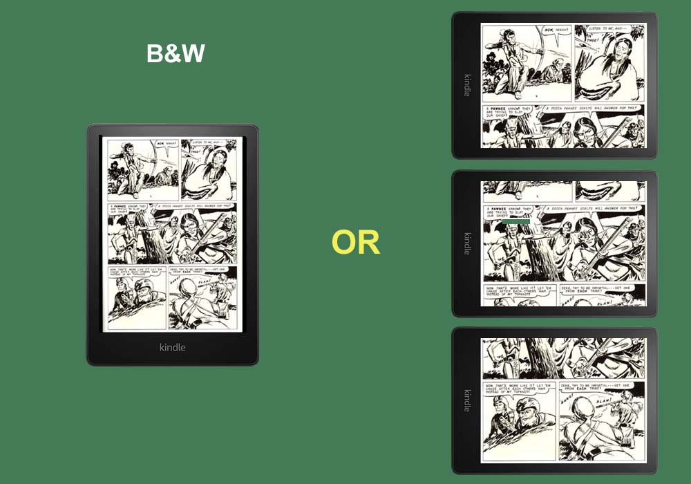
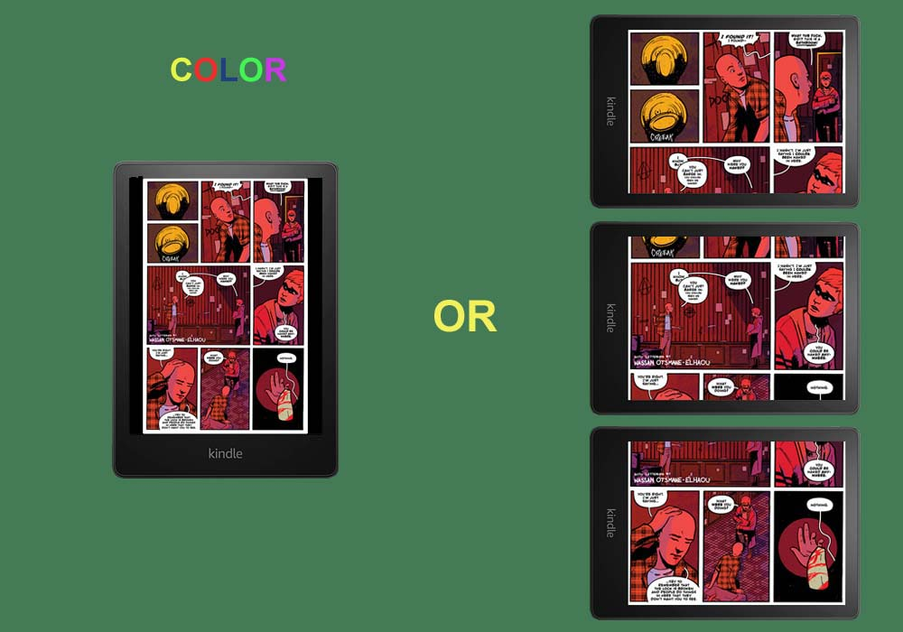

<h1 align="center"><b>comic2kindle</b></h1>
<h4 align="center">Um conversor de quadrinhos para PDF otimizado para dispositivos Kindle</h4>

* * *

## O que ele faz

**comic2kindle** é um aplicativo desktop que converte páginas de quadrinhos (de pastas, arquivos CBR ou CBZ) em PDFs otimizados para leitura em dispositivos Kindle. A ferramenta divide automaticamente cada página em múltiplos painéis e os rotaciona para visualização ideal em modo paisagem no Kindle Paperwhite, Kindle Colorsoft e outros modelos Kindle.

Apesar do nome, os PDFs gerados estão em formato padrão e podem ser visualizados em qualquer e-reader ou leitor de PDF, não apenas em dispositivos Kindle. A otimização foca no formato de 1264x1680 pixels que funciona perfeitamente em dispositivos Kindle, mas o resultado permanece totalmente compatível com todos os leitores de PDF, incluindo Kobo, PocketBook, tablets Android e visualizadores de PDF para desktop.

O aplicativo oferece um fluxo de trabalho completo para preparar seus quadrinhos digitais para a melhor experiência de leitura possível no Kindle:

- **Importe** quadrinhos de pastas de imagens, CBR (Comic Book RAR) ou CBZ (Comic Book Zip)
- **Edite** páginas com ferramentas visuais de corte, detecção de margens e marcação de páginas (capa/página inteira)
- **Exporte** para PDF com divisão automática de painéis e rotação para visualização otimizada no Kindle

*Prévia do plugin*

## Download

Obtenha as versões mais recentes na [página de download](https://github.com/eremita-oficial/comic2kindle/releases).

| Plataforma | Versões |
|------------|---------|
| Windows x64 | `.exe` Portátil |
| Linux x64 | AppImage |
| Código-fonte | `.zip`, ou clone este repositório |

---

## Funcionalidades

- **Suporte a Múltiplos Formatos**: Importe de pastas de imagens, CBR e CBZ
- **Divisão Inteligente de Painéis**: Divide automaticamente cada página em 3 painéis para leitura otimizada no Kindle
- **Rotação Inteligente**: Rotaciona os painéis -90° para visualização em modo paisagem no Kindle
- **Gerenciamento de Páginas**: Marque páginas como capas ou páginas inteiras (sem divisão)
- **Corte Visual**: Corte interativo de margens com opções de corte automático e baseado em porcentagem
- **Gerenciamento de Projetos**: Salve/abra projetos nos modos completo ou leve
- **Controle de Qualidade**: Exporte com compressão JPEG de alta qualidade (95%) ou econômica (80%)
- **Suporte a Metadados**: Adicione informações de título e autor aos PDFs exportados
- **Interface Amigável**: GUI intuitiva com navegação por miniaturas e controles de zoom

---

## Instalação

### Pré-requisitos

- Python 3.8 ou superior
- Para suporte a CBR: ferramenta de linha de comando `unrar` ou `rar`
  - **Ubuntu/Debian**: `sudo apt-get install unrar`
  - **Manjaro/Arch**: `sudo pamac install unrar`
  - **macOS**: `brew install unrar`
  - **Windows**: Instale WinRAR ou 7-Zip e adicione ao PATH

### A partir do código-fonte

# Clone o repositório
git clone https://github.com/yourusername/comic2kindle.git
cd comic2kindle

# Instale as dependências
pip install -r requirements.txt

# Execute o aplicativo
python gui.py

# Dependências

pip install pillow opencv-python numpy reportlab img2pdf

---

## Como usar

1. **Inicie o aplicativo**: Execute `python gui.py` ou use o executável fornecido
2. **Importe seu quadrinho**: Clique em `Arquivo → Abrir pasta`, `Abrir CBR` ou `Abrir CBZ`
3. **Edite as páginas** (opcional):
   - Use `Detectar Margens` para corte automático
   - Marque páginas como `Capa` ou `Página Inteira`
   - Corte páginas manualmente com o editor visual
4. **Exporte para PDF**: Selecione `Exportar PDF (3 painéis)` ou `Exportar PDF (páginas inteiras)`
5. **Adicione metadados**: Insira título e autor quando solicitado
6. **Escolha o local de salvamento**: Selecione onde salvar seu PDF otimizado

### Atalhos de Teclado

| Atalho | Ação |
|--------|------|
| `← / →` | Página anterior/próxima |
| `Ctrl+O` | Abrir pasta/CBR/CBZ |
| `Ctrl+S` | Salvar projeto completo |
| `Ctrl+Shift+S` | Salvar projeto leve |
| `Ctrl+Shift+O` | Abrir projeto |
| `ESC` | Cancelar modo de corte |
| `Del` | Cortar margens marcadas |
| `Ctrl+Delete` | Remover página atual |
| `Ctrl++ / Ctrl+-` | Zoom in/out |
| `Ctrl+0` | Ajustar à altura |
| `Ctrl+9` | Zoom 100% |
| `Ctrl+Q` | Sair |

---

## Licença

**comic2kindle** é licenciado sob a licença [Creative Commons Zero v1.0 Universal](https://creativecommons.org/publicdomain/zero/1.0/deed.en) License.

---

*Feito com ❤️ para amantes de quadrinhos e leitores de Kindle em todo lugar.*
